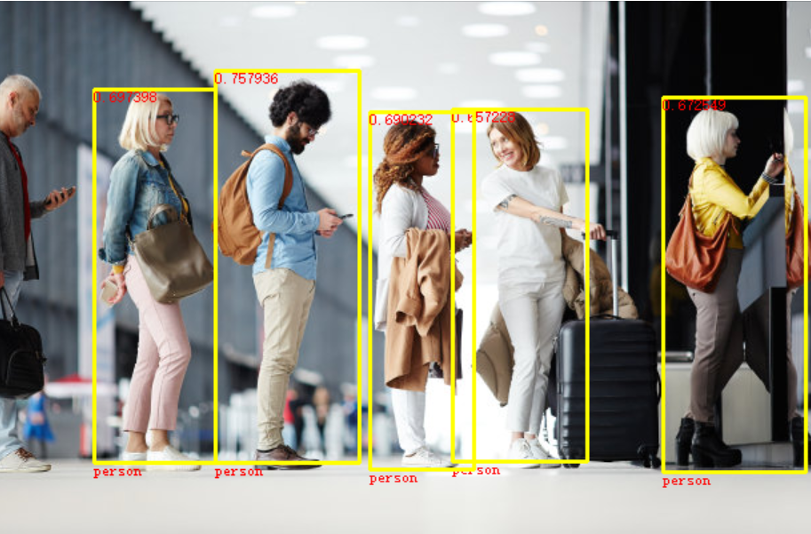

# LibMatch

- Cur Version 0.9.5
- Last Updated: 2024-03-03

纯技术交流群：767178345（带审核）

- [QUICK START](usage.md)

## Effect Demo

## Description

LibMatch is a library for template match , yolo match , OCR , orb feature match and screenshot.

LibMatch 是一个用于模板匹配，yolo匹配，文本识别，orb特征匹配和截图的库。

LibMatch has extremely tiny small size, and it is easy to use. It is suitable for use in various scenarios, such as game automation, image recognition, and so on.

LibMatch 体积极小，易于使用。适用于各种场景，如游戏自动化，图像识别等。

LibMatch is written in C++ and provides a C interface. It can be used in C++ and other languages that support C API.

LibMatch 用C++编写，并提供C接口。可以在C++和其他支持C API的语言中使用。

## Features

- Template Match (模板匹配)
- Yolo Match (Yolo匹配)
- OCR and can locate single characters (OCR 并且可以单字定位)
- ORB Feature Match (ORB特征匹配)
- Manually implement the search for the homology matrix (手动实现寻找单应性矩阵)
- Screenshot (截图)
- C API (C接口)
- C++ API (C++接口)
- Elanguage API (易语言调用)

## Todo List

- [ ] Add interface for Python (添加Python接口)
- [ ] Add interface for C# (添加C#接口)
- [ ] Add interface for Java (添加Java接口)
- [ ] Add interface for 按键精灵 (添加按键精灵接口)
- [ ] Add interface for 火山开发平台 (添加火山开发平台接口)
- [ ] Support Linux (支持Linux)
- [ ] Support Android (支持Android)
- [ ] Import Yolov6,v8 (It needs that I had read the paper.)
- [ ] Decrease the size of the library (减小库的体积)
- [ ] Add more examples (添加更多的例子)
- [ ] Add more documents (添加更多的文档)
- [ ] Import the Algorithm of CAPTCHA (加入验证码算法)

## Support Platform

- Windows 32/64

# Star History

